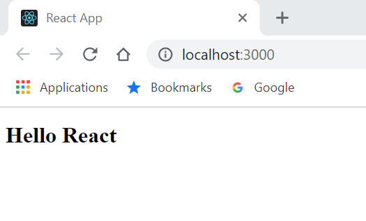

# react-projet

## React c'est quoi?
React.Js, est une techno Javascript, mais il ne s’agit pas d’un framework à proprement parler.</br> 
En fait, il s’agit plus d’une librairie open source qui permet de construire des interfaces utilisateur dynamique. </br>
Et, de plus, cette librairie est maintenue un grand nombres de développeurs indépendants.</br>
Pour coder en React, vous devez avoir de bonnes bases en javascript, bien évidemment. 
</br>
C’est par ailleurs une techno très appréciée par développeurs web ces derniers temps. Elle permet de réaliser des applications web cross platform et ultra-performantes. 
</br>
Ce sont les équipes de Facebook qui sont à l’origine de cette plateforme. En effet, c’est en 2013 qu’est né React. 

## Créer et lancer un projet react

Pour créer un nouveau projet react, il faut dans un terminal, faire la commande:
```shell
create-react-app nom-projet
```
Après l'instalation, on peut lancer notre projet avec la commande:
```shell
npm start
```
Pour compiler un projet react, on utilise la commande 
```shell
npm run build
```
## Structure d'un fichier react - Le composant basique


Tous les composant se resemble, il sont composé comme ceci:
- D'abord, il y a l'import de toutes nos bibliothéques
- Ensuite, on a **un composant** (**``retenir qu'un composant = une fonction``**)
- Ensuite on déclare **nos variable**
- Puis on déclare de **la logique**, autrement dit des fonction de notre composant
- Puis on renvoie notre **rendu visuel** (en **``JSX``**)
- Et enfin, on **export notre composant**
## Installation utile pour notre projet
```shel
npm i -save react-dom react-router-dom node-sass@4.14.1
```
- ``react-dom``: Le module react-dom fournit des méthodes spécifiques au DOM que vous pouvez utiliser au niveau racine de votre appli et comme échappatoire pour travailler hors du modèle React si vous en avez besoin.
- ``react-router-dom``: React Router est une extension a React qui permet de gérer les routes d'une application coté client. Il permet de synchroniser (d'associer) des composants graphiques React à des urls.
- ``node-sass@4.14.1``(@numéro de la version, permet de choisir la version à installer):Le langage SASS est un préprocesseur CSS capable de gérer vos projets CSS en générant des feuilles de styles (fichier . css). Le CSS3, est un langage en soi que les navigateurs interprètent.
## Explication d'un projet react
Un projet react, et de 3 gros dossier:
- Les ``node_modules``: c'est l'ensemble des bibliothéque utiliser dans notre projet
- Le dossier ``public``: contient tous nos fichier static. Nos images, et notre **``index.html``**

Le fichier index.html qui va contenir notre projet react.

Toute notre application est contenu dans le body, dans la div d'id root
```html
<div id="root"></div>
```
- Et enfin, le fichier ``src``: On va y trouver nos fichier css, nos composant, nos pages, nos fichiers ***index.js*** 

L'index.js est le fichier par lequelle on a accès dans notre appli. il est le fichier qui dans la balise d'id ``root`` va placer notre composant ``App``
## Création d'un composant la bonne pratique
Supprimer app.js, app.css, app.html dans index .js retirer l'import à app puis créer un dossier **composant** et créer un fichier ***App.jsx***
```jsx
import React, {Fragment} from "react";

export class App extends React.Component {

    render(){
        return (
            <Fragment>
                <h1>Hello React</h1>
            </Fragment>
        )
    }
};
export default App;
```
### La balise fragment 
La balise Fragment permet d'englober les balises JSX d'une manière plus propre :

JSX avec Fragment:
```jsx
import React, { Fragment } from 'react';
import './App.css';
const App = () => {
    return (
        <Fragment>
            <p className="App">Simple Page</p>
            <p className="App">Exemple</p>
        </Fragment>
    );
}
```
Cette balise n'apparaitra pas dans le navigateur.
## Test de fonctionnement

Dans le fichier App.js, on peut supprimer tout le rendu et y mettre:
```jsx
function App() {
  return (
    <div className="App">
      <h1>Hello React</h1>
    </div>
  );
}
export default App;
```
resultat:</br>

 ## Création de notre première page
Dans un dossier ``pages``, on va créer notre page Home -> ``Home.jsx``.

```jsx
import React, {Fragment} from "react";

const Home = () => {
    return(
        <Fragment>
            <h1>Acceuil</h1>
        </Fragment>
    )
}
export default Home;
```
Et pour afficher notre composant, dans le fichier App.jsx, on appelle notre page:
```jsx
import React, {Fragment} from "react";
import Home from "../pages/Home"; 

export class App extends React.Component {

    render(){
        return (
            <Fragment>
                <h1>Hello React</h1>
                <Home />
            </Fragment>
        )
    }
};
export default App;
```
resultat:</br>


Sur visual studio code, on peut installer les pluggins ***``Reactjs code snippets``*** et ***``Simple React Snippets``*** pour nous faciliter la création de composant react et des imports

## Reactjs code snippets et Simple React Snippets
A le création d'un composant, dans le fichier écrire ``rsc`` et le composant va se créer tous seul:
```jsx
rsc
```
resultat:
```jsx
import React from 'react';

const Composant = () => {
    return (
        <div>
            
        </div>
    );
};

export default Composant;
```
## Rooting et Navigation
### Rooting
D'abord, on va créer une deuxieme pages: la page ``About``
```jsx
import React, {Fragment} from 'react';

const About = () => {
    return (
        <Fragment>
            <h1>À propos</h1>
            <br />
            <p>Lorem ipsum dolor sit amet consectetur adipisicing elit. Consectetur placeat veniam quidem, dolorem unde optio doloremque tempore minima aliquam reprehenderit. Autem, tempore fugiat! Hic, qui reiciendis odio tempore molestiae quos.</p>
            <br />
            <p>Lorem ipsum dolor sit amet consectetur adipisicing elit. Sed dicta sequi doloribus consectetur, praesentium, ex sapiente laboriosam natus modi repudiandae omnis maiores ut et, ratione inventore beatae? Nesciunt molestias consectetur sapiente, ab tenetur unde odit ipsum officia perferendis non, corporis modi? Doloribus expedita atque, aliquid sed dignissimos, animi suscipit accusantium nulla consectetur quibusdam ipsa. Officia ea perferendis veritatis numquam cum?</p>
        </Fragment>
    );
};
export default About;
```
et une page 404 au cas ou
```jsx
import React, {Fragment} from 'react';

const NotFound = () => {
    return (
        <Fragment>
            <h1>Erreur 404: Not Found</h1>
        </Fragment>
    );
};
export default NotFound;
```
Maintenant, on a notre arborescence de notre application, du coup, on va pouvoir faire notre navigation.

Dans notre fichier ``App.jsx`` on va d'abords importer des modules
```jsx
import { BrowserRouter, Switch, Route} from "react-router-dom"
```
Puis, on va créer notre premiere route vers la page home
```jsx
<Fragment>
    <BrowserRouter>
        <Switch>
            <Route path="/" component={Home}/>
        </Switch>
    </BrowserRouter>
</Fragment>
```
- ``BrowserRouter``: Il englobe toute notre application
- ``Switch``: Test toutes les routes et si elle n'existent pas, nous redirige vers notre page 404
- ``Route``: Nos route disponible
Notre fonction, cependant si dans l'url, on ecrit n'importe quoi, on arrive toujours sur la page Home. 

Pour corriger cela, on va rajouter le mot clé ``exact`` pour lui dire qui faut le nom exact de la page pour y accéder
```jsx
<Fragment>
    <BrowserRouter>
        <Switch>
            <Route path="/" exact component={Home}/>
        </Switch>
    </BrowserRouter>
</Fragment>
```
Pour la redirection vers notre page 404, a la fin de la liste des route, on va rajouter:
```jsx
<Route component={NotFound}/>
```
Cela permet à react de comprendre que si l'url ne correspond a aucune page, la redirection sa fait vers la page 404.

Notre navigation fina, resemble donc à:
```jsx
<Fragment>
    <BrowserRouter>
        <Switch>
            <Route path="/" exact component={Home}/>
            <Route path="/about" exact component={About}/>
            <Route component={NotFound}/>
        </Switch>
    </BrowserRouter>
</Fragment>
```
### Navigation
Pour ce créer une navigation, on va devoir se créer un *composant* *``Navigation``* utilisable partout. Pour cela il va falloir importer un nouveau module de ``react-router-link`` qui s'appelle ``NavLink``

NavLink: module qui va nous permettre en cliquant dessus d'aller de page en page
```jsx
import React, {Fragment} from 'react';
import { NavLink } from 'react-router-dom';

const Navigation = () => {
    return (
        <Fragment>
            <div className="navigation">

            </div>
        </Fragment>
    );
};
export default Navigation;
```
Puis on va utiliser NavLink, pour bouger d'url en url
```jsx
<Fragment>
    <div className="navigation">
        <NavLink exact to="/">
            Acceuil
        </NavLink>
        <NavLink exact to="/about">
            À propos
        </NavLink>
    </div>
</Fragment>
```
Ce composant, il faut l'appeler dans toutes les pages qui va avoir besoin de ce composant:
```jsx
const Home = () => {
    return(
        <Fragment>
            <Navigation />
            <h1>Acceuil</h1>
        </Fragment>
    )
}
```
Il est possible de mettre du CSS à notre module NavLink:
```jsx
<NavLink exact to="/" activeClassName="nav-active">
```
ici, on lui dit que lorsque que le lien est actif, il à la classe ``nav-active``

## Le Style
On créer un dossier styles, puis un fichier ``index.scss`` que l'on va appeller dans notre fichier index, qui va nous permettre d'importer nos fichiers de style:
```js
import "./styles/index.scss";
```
Ensuite, on va créer un fichier ``_settings.scss`` (le ``_`` permet de montrer que ce n'est pas le fichier mettre), c'est le fichier ou on a nos variable, nos couleurs, et les réglages global.

Ensuite, on va créer un dossier components, qui va comprendre tous les style de nos composants, puis le fichier ``_navigation.scss`` pour le style de notre navigation.

Dans ce fichier, on va pouvoir créer une classe navigation, qui va contenir tout le style de navigation
```scss
.navigation{
    margin: 20px;
    display: flex;

    a {
        margin: 10px;
        padding: 10px;
        position: relative;
    }
}
```
On va pouvoir aussi changer la classe nav-active (la class de nos NavLink)
```scss
.navigation{
    margin: 20px;
    display: flex;

    a {
        margin: 10px;
        padding: 10px;
        position: relative;
    }

    .nav-active {
        &::after {
            content: '';
            width: 85%;
            height: 5px;
            background: $color-1;
            position: absolute;
            bottom: 1px;
            left: 60%;
            transform: translate(-50px);
        }
    }
}
```

## Les images
Pour notre log, on va créer un composant Logo, qui va contenir notre image, et que l'on appelera dans chaque pages
```jsx
import React, {Fragment} from 'react';

const Logo = () => {
    return (
        <Fragment>
            <div className="logo">
                
                <h3>React World</h3>
            </div>
        </Fragment>
    );
};
export default Logo;
```
Puis on va l'appeller dans nos pages
```jsx
<Fragment>
    <div className="home">
        <Navigation />
        <Logo />
        <h1>Acceuil</h1>
    </div>
</Fragment>
```
**``Attention :``** Lorsque l'on recherche une image dans un fichier jsx, on commence notre arborescence à la racine du dossier ``public``

## Les hooks
Les Hooks sont une nouveauté de React 16.8. Ils permettent de bénéficier d’un état local et d’autres fonctionnalités de React sans avoir à écrire de classes.

Pour la demo, on va créer un composant ``country`` que l'on va afficher sur la home
```jsx
import React, {Fragment} from 'react';

const Countries = () => {
    return (
        <Fragment>
            <div className="countries">
                <h1>pays</h1>
            </div>
        </Fragment>
    );
};

export default Countries;
```

Ensuite, pour l'exemple, on va créer une constante pour gerer nos données grace au ``state``
```jsx
const [data, setData] = useState("hello")
```
Cette variable posséde un nom (ici *data*) et un deuxieme éléments qui est l'élément par lequel on passera pour modifier nos données</br>
Maintenant, si dans notre composant on affiche ***data***, il va nous afficher la valeur stocker dans notre constance
```jsx
<Fragment>
    <div className="countries">
        <h1>{data}</h1>
    </div>
</Fragment>
```
resultat:</br>


---

Sur Google chrome, on peut utiliser le pluggin ***``React Developer Tools``*** pour avoir des information sur notre projet react


---

Cette variable data, on peut la faire évoluer en utilisant notre ``setData``, pour cela, on peut créer une fonction:
```jsx
const sayGoodBye = () =>{
    setData("GoodBye");
}
```
et pour l'appeller, on va créer un bouton, lorsque l'on va cliquer dessus, il changera l'etat de notre constante data
```jsx
<button onClick={sayGoodBye}>Dire au revoir</button>
```
## L'api restcountries

[Liste des pays](https://api.countrylayer.com/v2/all?access_key=0b61456a39c2d96e9af0e3dfdf6c1148)

Pour aller chercher les donner avec react, on va installer un nouvelle bibliotheque de react, ``axios`` qui va nous permettre de faire un fetch.
```shell
npm i -s axios
```
Gràce a cette bibliotheque, on peut recuperer les donner de notre api, et grace a notre ``setData``, inserer dans notre data, la reponse obtenue
```jsx
axios.get(
        'https://api.countrylayer.com/v2/all?access_key=0b61456a39c2d96e9af0e3dfdf6c1148'
    ).then((res) => setData(res.data))
```
### Le useEffect
**Que fait useEffect ?** On utilise ce Hook pour indiquer à React que notre composant doit exécuter quelque chose après chaque affichage. React enregistre la fonction passée en argument (que nous appellerons « effet »), et l’appellera plus tard, après avoir mis à jour le DOM. 

```jsx
useEffect(() => {
    axios.get(
    'https://api.countrylayer.com/v2/all?access_key=APY_KEY'
    ).then((res) => setData(res.data))
}, [])
```
Puis, on peut donc l'afficher dans notre composant
```jsx
<Fragment>
    <div className="countries">
        <ul className="countries-list">
            {data.map((country) => {
                <li>
                    {country.name}
                </li>
            })}
        </ul>
    </div>
</Fragment>
```
#### Rappel .map() Javascript
La méthode **``map()``** crée un nouveau tableau avec les résultats de l'appel d'une fonction fournie sur chaque élément du tableau appelant.
```js
const array1 = [1, 4, 9, 16];

// pass a function to map
const map1 = array1.map(x => x * 2);

console.log(map1);
// expected output: Array [2, 8, 18, 32]
```
## Les props
Après avoir récupéré les données avec l'api, on va maintenant créer un composant qui va récupérer de ``Countries.jsx`` c'est données pour les afficher.

Une fois ce comosant créer, on va devoir l'importer pour pouvoir l'utiliser dans countries
```jsx
import Card from './Card';
```
```jsx
<Fragment>
    <div className="countries">
        <ul className="countries-list">
            {data.map((country) => {
                <li>
                    <Card />
                </li>
            })}
        </ul>
    </div>
</Fragment>
```
Ensuite, dans notre composant Cards, on va maintenant lui passer nos données, pour cela, on va créer une **``props``** dans le composant ``Countries`` et pour lui passer notre variable dans le composant ``Cars``;
```jsx
<ul className="countries-list">
    {data.map((country) => {
        <li>
            <Cards country={country}/>
        </li>
    })}
</ul>
```
et Dans cars, pour les recupérer:
```jsx
const Cards = (props) => {

    console.log(props);
}
```
Attention, en React, il faut mettre une clé unique au props pour les différencier
```jsx
<Cards country={country} key={country.name}/>
```
**Le destructuring:**

 En javascript, et notamment en react, on peut facilité l'appel des props.

En effet, au lieu de toujours faire:
```jsx
props.country.name
``` 
Et de toujours devoir mettre le mots ``props``, on peut **``Destructurer``** notre variable pour ne pas l'écrire
```jsx
const { country } = props;
```
Grace à cette methode, on peut acceder au donnée directement:
```jsx
<Fragment>
    <li className="cards">
        
        <div className="data-container">
            <ul>
                <li>{country.name}</li>
                <li>{country.capital}</li>
                <li>Pop. {country.population}</li>
            </ul>
        </div>
    </li>
</Fragment>
```
Après avoir fait le style ect.., on va maintenant créer une fonction pour séparrer les milliers et avoir un affichage du nombres de population plus claire

Dans ``Cards.jsx``:
```jsx
const numberFormat = (x) => {
    return x.toString().replace(/\B(?=(\d{3})+(?!\d))/g, " ");
}
```
Puis, dans notre création de card, on peut l'appeler pour avoir un nombre bien structurer
```jsx
<ul>
    <li>{country.name}</li>
    <li>{country.capital}</li>
    <li>Pop. {numberFormat(country.population)}</li>
</ul>
```
## Trier les données & Input range
### Trier les données
On va d'abord trier nos pays par ordre de population, pour cela on va d'abord créer une variable qui récupérera nos pays trier
```jsx
const [sortedData, setSortedData] = useState([]);
```
Dans le useEffect, on va se créer une fonction pour trier nos pays, pour cela, il va falloir transformer notre data en objet pour pouvoir utiliser la fonction ``sort()`` pour trier nos pays et ensuite modifier notre variable ``sortedData`` pour récupérer nos pays trier
```jsx
const sortedCountry = () => {
    const countryObj = Object.keys(data).map((i) => data[i]);
    const sortedArray = countryObj.sort((a,b) => {
        return b.population - a.population
    });
    setSortedData(sortedArray)
}
```
Nous pouvons remarquer un problème, en effet, comme **le javascript est un language asynchrone**, notre objet est vide. Car, on utilise notre fonction avant que notre data ne soit remplie.

Pour pallier a ce problème, on va dire a notre useEffect de s'utiliser lorsque data et mis à jours
```jsx
useEffect(() => {
    axios.get(
        'https://api.countrylayer.com/v2/all?access_key=0b61456a39c2d96e9af0e3dfdf6c1148'
    ).then((res) => setData(res.data)) 
    const sortedCountry = () => {
        const countryObj = Object.keys(data).map((i) => data[i]);
        const sortedArray = countryObj.sort((a,b) => {
            return b.population - a.population
        });
        setSortedData(sortedArray)
    }
    sortedCountry();
}, [data])
```
Deuxieme erreur, comme a chaque utilisation du useEffect, on actualise data, cela créer une boucle infinie. Pour empécher cela, il faut executer ***le fetch*** qu'une seule fois.

On va donc créer une nouvelle variable qui sera un *Boolean* et qui nous permettra de savoir si oui on non, le fetch a deejà etait utilisé
```jsx
const [playOnce, setPalayOnce] = useState(true);
```
Puis on modifie notre useEffect pour retirer notre boucle infinie
```jsx
if(playOnce) {
    axios.get(
        'https://api.countrylayer.com/v2/all?access_key=0b61456a39c2d96e9af0e3dfdf6c1148'
    ).then((res) => {
        setData(res.data);
        setPalayOnce(false)
    }) 
}
```
Enfin, pour avoir les pays trier, il faut modifier l'envoi des props vers notre conposant card
```jsx
 <ul className="countries-list">
    {sortedData.map((country) => {
        <li>
            <Cards country={country} key={country.name}/>
        </li>
    })}
</ul>
```
### Les input range
Maintenant, on créer notre imput pour permettre de choisir le nombre de pays que l'on veux afficher. 

D'abbord on va créer un variable pour mettre une valaur par default du nombre de pays que l'on veut, ici pour l'exemple, on affiche 40 pays
```jsx
const [rangeValue, setRangeValue] = useState(40);
```
Puis dans notre fonction on va dire, le nombre de sortie du tableau pays que l'on doit recuperer
```jsx
onst sortedCountry = () => {
    const countryObj = Object.keys(data).map((i) => data[i]);
    const sortedArray = countryObj.sort((a,b) => {
        return b.population - a.population
    });
    // On lui dit que la taille de notre tableau et de la valeur de 'rangeValue'
    sortedArray.lenght = rangeValue;
    setSortedData(sortedArray)
}
```
Ensuite, on va créer notre ``input range``:
```jsx
<Fragment>
    <div className="countries">
        <div className="sort-container">
            <input type="range" min="1" max="250" value={rangeValue} />
        </div>
        <ul className="countries-list">
            {sortedData.map((country) => {
                <li>
                    <Cards country={country} key={country.name}/>
                </li>
            })}
        </ul>
    </div>
</Fragment>
```
Pour changer la valeur de ``rangeValue``, in faut utiliser *l'event* ***onChange*** et la fonction ***setRangeValue*** pour mettre à jour notre variable
```jsx
<input type="range" min="1" max="250" value={rangeValue} onChange={(e) => setRangeValue(e.target.value)} />
```
et on oublie pas de relancer le useEffect à chaque modification de la valeur ``rangeValue``
```jsx
useEffect(() => {
    // Code du useEffect
    ...
}, [data, rangeValue, playOnce])
```
## Input Radio